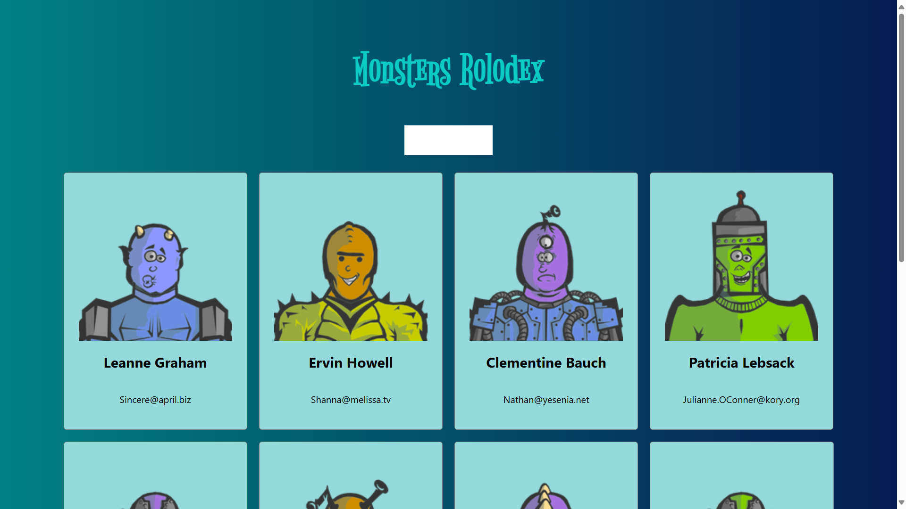
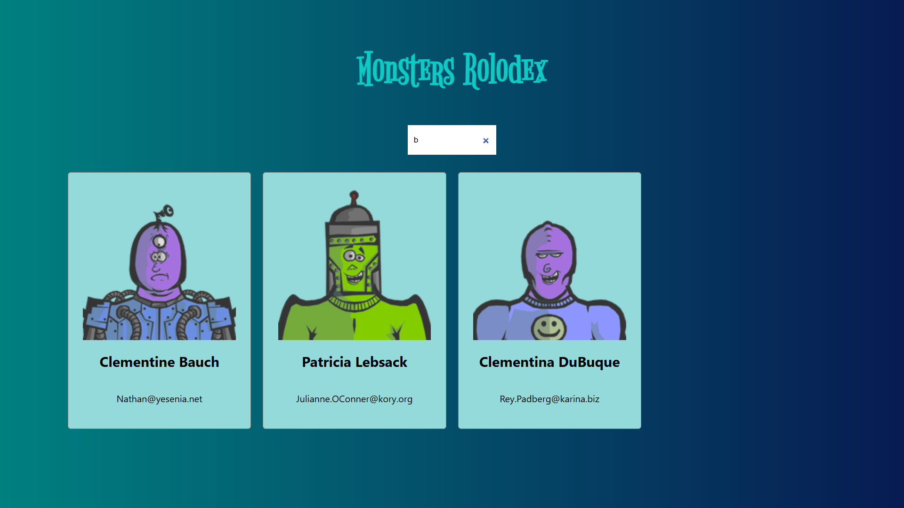

# Monsters Rolodex 🎃📇



Monsters Rolodex is a React-based web application that allows you to search and display a list of "monsters" retrieved from a JSON placeholder API. The app features a responsive design and interactive search functionality, making it a fun and engaging project!

---

## Features / Características

- **Dynamic Search**: Search monsters in real time using the search box.
- **Responsive Cards**: Display monster information using card components.
- **External API Integration**: Fetch user data from [JSONPlaceholder](https://jsonplaceholder.typicode.com/users).
- **Modern React Hooks**: Utilize `useState` and `useEffect` for state management and side effects.

---

## Project Structure / Estructura del Proyecto

- **package.json**  
  Contains the project configuration and dependencies, including React, React DOM, and testing libraries.

- **App.js**  
  The main component that:
  - Fetches monster data.
  - Manages search state.
  - Filters monsters based on the search input.
  - Renders the header, search box, and card list.

- **components/card-list/card-list.component.jsx**  
  Renders a list of `Card` components for each monster.

- **components/card/card.component.jsx**  
  Displays individual monster details including a unique image, name, and email.

- **components/search-box/search-box.component.jsx**  
  Provides the search input functionality.

---

## Getting Started / Empezando

### Prerequisites / Requisitos

- [Node.js](https://nodejs.org/)
- [Yarn](https://yarnpkg.com/) (opcional, pero recomendado)

### Installation / Instalación

1. **Clone the repository:**

   ```bash
   git clone https://github.com/elidepb/MONSTER-ROLODEX-REACT.git
   cd MONSTER-ROLODEX-REACT
   ```

2. **Install dependencies:**

   Using Yarn:

   ```bash
   yarn install
   ```

   Or using npm:

   ```bash
   npm install
   ```

3. **Run the application:**

   With Yarn:

   ```bash
   yarn start
   ```

   With npm:

   ```bash
   npm start
   ```

4. **Build for production:**

   Using Yarn:

   ```bash
   yarn build
   ```

   Or with npm:

   ```bash
   npm run build
   ```

5. **Run tests:**

   With Yarn:

   ```bash
   yarn test
   ```

   Or with npm:

   ```bash
   npm test
   ```

---

## Screenshots / Capturas de Pantalla

Place your screenshots in the `./screenshots` folder and reference them in this README.


*Home Page of Monsters Rolodex*

---

## Useful Commands / Comandos Útiles

- **Start the development server:**

  ```bash
  yarn start
  ```

- **Build the app for production:**

  ```bash
  yarn build
  ```

- **Run tests:**

  ```bash
  yarn test
  ```

- **Eject the configuration (advanced):**

  ```bash
  yarn eject
  ```

---

## Contributing / Contribuyendo

Contributions are welcome! Please open an issue or submit a pull request for any improvements or bug fixes.

¡Las contribuciones son bienvenidas! Por favor, abre un *issue* o envía un *pull request* para mejoras o correcciones.

---

## License / Licencia

This project is open source under the [MIT License](LICENSE).

Este proyecto es de código abierto bajo la [Licencia MIT](LICENSE).

---

## Contact / Contacto

Feel free to reach out if you have any questions or suggestions.

No dudes en contactarme si tienes preguntas o sugerencias.

---

Happy coding! 🚀
¡Feliz programación! 🎉
```
